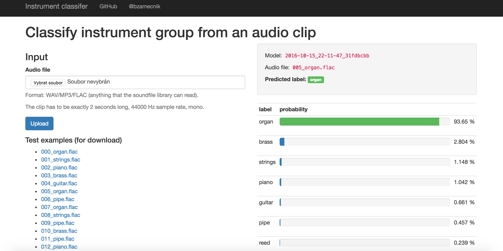

# Deep Instrument

Deep learning model to classify music instrument groups from audio.

> [Try this app running on Heroku](http://deep-instrument.herokuapp.com/)!

Upload an audio clip and see the predicted class. You can download a few text examples or provide you own clips.

[](http://deep-instrument.herokuapp.com/)

This a Heroku deployment repo. Look at the main repo [bzamecnik/ml](https://github.com/bzamecnik/ml/tree/master/instrument-classification) to see the training scripts, etc.

## Requirements

```
Python 3.4 (eg. via Anaconda), Keras, TensorFlow, etc.

$ pip install -r requirements.txt
```


## Run locally

```
$ python main.py && open http://localhost:5000
```

## Deploy to Heroku

Deploy your own instance of this app!

```
$ heroku apps:create [NAME]
$ heroku buildpacks:add heroku/python
$ git push heroku master
```

or more easily via the Heroku Button:

[](https://heroku.com/deploy)
